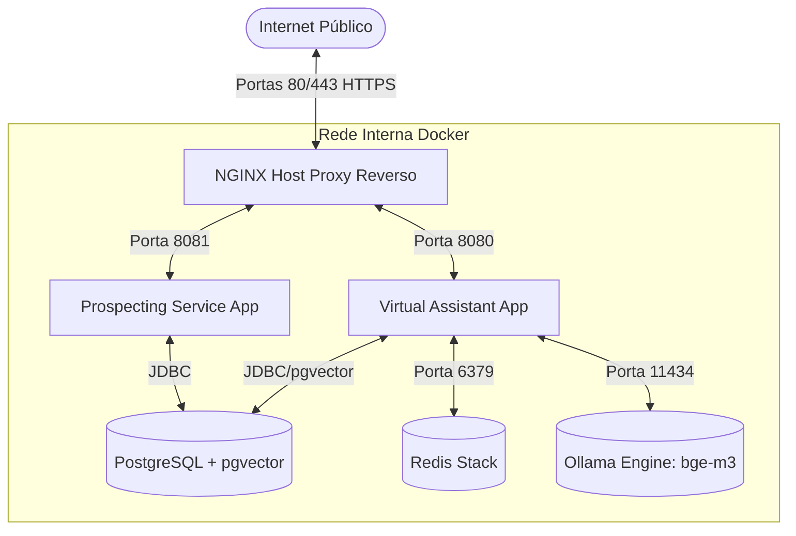

# Guia de Implantação: QR369-GCP no Oracle Cloud Infrastructure (OCI) ARM64

Este guia apresenta o passo a passo completo para instalar, configurar e colocar em produção o projeto **QR369-GCP** em uma instância de computação da OCI (Ampere A1, arquitetura ARM64/aarch64) executando o sistema operacional **Ubuntu 24.04 LTS (Noble Numbat)** e contendo apenas o servidor **NGINX** instalado previamente no host.

---

## 📸 Arquitetura de Implantação

A infraestrutura utilizará o **Docker** e o **Docker Compose** instalados diretamente na instância OCI para isolar e gerenciar todos os microsserviços e bancos de dados. O **NGINX** pré-instalado no host atuará como um proxy reverso HTTPS, encaminhando as conexões públicas externas para os contêineres internos correspondentes.



---

## 🛠️ Passo 1: Liberação de Portas e Firewall (OCI & Host)

As instâncias OCI possuem duas camadas de firewall por padrão: a rede virtual e as tabelas `iptables` locais do sistema operacional Ubuntu. Para que o NGINX consiga receber requisições de fora, ambas as camadas precisam estar liberadas para as portas **80 (HTTP)** e **443 (HTTPS)**.

### 1.1 Configuração na OCI (Console Cloud)
1. Acesse o console da OCI.
2. Navegue até **Networking** > **Virtual Cloud Networks (VCN)**.
3. Clique sobre a VCN em que sua instância está rodando.
4. No menu lateral esquerdo, clique em **Security Lists** e selecione a lista de segurança padrão (Default Security List).
5. Clique em **Add Ingress Rules** e configure a seguinte regra:
   * **Source Type**: `CIDR`
   * **Source CIDR**: `0.0.0.0/0`
   * **IP Protocol**: `TCP`
   * **Destination Port Range**: `80,443`
   * **Description**: `HTTP and HTTPS access for NGINX host`
6. Salve a regra.

### 1.2 Configuração do Firewall Host (Ubuntu 24.04 `iptables`)
O Ubuntu distribuído pela OCI vem com uma configuração rígida do `iptables` ativo que bloqueia portas locais por padrão. 

Acesse a instância via SSH e execute os seguintes comandos para permitir tráfego nas portas HTTP/HTTPS e salvar a regra persistentemente:

```bash
# Insere as regras de aceitação de tráfego HTTP e HTTPS antes da última regra de descarte (REJECT)
sudo iptables -I INPUT 6 -p tcp --dport 80 -j ACCEPT
sudo iptables -I INPUT 6 -p tcp --dport 443 -j ACCEPT

# Salva as regras locais persistentemente
sudo DEBIAN_FRONTEND=noninteractive apt-get install -y iptables-persistent
sudo netfilter-persistent save
```

---

## 🐋 Passo 2: Instalação do Docker e Docker Compose no Ubuntu 24.04 ARM64

A arquitetura Ampere A1 (ARM64) é excelente para custo-benefício e possui suporte completo e nativo ao ecossistema do Docker.

### 2.1 Adicionar chave GPG do repositório oficial do Docker:
```bash
sudo apt-get update
sudo apt-get install -y ca-certificates curl
sudo install -d /etc/apt/keyrings
sudo curl -fsSL https://download.docker.com/linux/ubuntu/gpg -o /etc/apt/keyrings/docker.asc
sudo chmod a+r /etc/apt/keyrings/docker.asc
```

### 2.2 Configurar o Repositório Oficial do Docker (Noble Numbat 24.04):
```bash
echo \
  "deb [arch=$(dpkg --print-architecture) signed-by=/etc/apt/keyrings/docker.asc] https://download.docker.com/linux/ubuntu \
  $(. /etc/os-release && echo "$VERSION_CODENAME") stable" | \
  sudo tee /etc/apt/sources.list.d/docker.list > /dev/null
```

### 2.3 Instalar o Docker Engine e utilitários:
```bash
sudo apt-get update
sudo apt-get install -y docker-ce docker-ce-cli containerd.io docker-buildx-plugin docker-compose-plugin
```

### 2.4 Habilitar e testar o Docker sem a necessidade de `sudo`:
```bash
sudo usermod -aG docker $USER
# Aplica a permissão sem necessidade de reiniciar a sessão SSH
newgrp docker

# Testar se o docker responde corretamente
docker run --rm hello-world
```

---

## 📂 Passo 3: Clonagem da Aplicação e Configurações de Ambiente

Com as ferramentas de execução preparadas, baixe e configure os arquivos da aplicação no servidor:

1. Clone o repositório na pasta raiz do usuário:
   ```bash
   git clone <URL_DO_REPOSITORIO> ~/QR369-GCP
   cd ~/QR369-GCP
   ```

2. Crie e configure o arquivo de variáveis de ambiente:
   ```bash
   cp .env.example .env
   nano .env
   ```
   > [!IMPORTANT]
   > Configure a senha do banco de dados (`VA_DB_PASSWORD`) de forma segura e insira a chave secreta da API do Anthropic (`ANTHROPIC_API_KEY`).
   > Mantenha a configuração `SPRING_PROFILES_ACTIVE` de acordo com a sua necessidade (ex: `anthropic`).

---

## ⚡ Passo 4: Executando as Aplicações via Docker Compose (ARM64)

Todos os contêineres declarados no `docker-compose.yml` possuem compatibilidade oficial com a arquitetura ARM64:
- **Base Builder & JRE** (`maven:3.9-eclipse-temurin-21-jammy` e `eclipse-temurin:21-jre-jammy`): O Docker compila o Java JAR localmente na máquina ARM64 e cria contêineres nativos.
- **pgvector/pgvector:pg16**: Possui binários compilados nativamente em ARM64. Puxado diretamente do registro.
- **redis/redis-stack:latest**: Oficialmente compatível com ARM64.
- **ollama/ollama:latest**: Possui suporte estável para CPU ARM64.

1. Para compilar os microsserviços internamente na máquina física do OCI e inicializar todos os contêineres de infraestrutura, rode:
   ```bash
   docker compose up -d --build
   ```

2. O contêiner do **Ollama** irá rodar em segundo plano e, após iniciar, fará o download automático do modelo de embeddings `bge-m3`. Acompanhe a evolução de inicialização e downloads nos logs gerais:
   ```bash
   docker compose logs -f
   ```

3. Verifique se todos os contêineres estão com status `healthy`:
   ```bash
   docker compose ps
   ```

---

## 🔒 Passo 5: Configuração do NGINX no Host (Proxy Reverso e SSL/HTTPS)

O NGINX pré-instalado gerenciará as conexões de entrada públicas e as repassará internamente para os respectivos serviços de porta.

> [!WARNING]
> **Por que `http://<IP_DO_OCI>:8080` dá Timeout?**
> A tentativa de acesso direto às portas internas (`8080`, `8081`, etc.) a partir da internet vai expirar (timeout). Isso ocorre porque apenas as portas explicitamente liberadas na OCI Security List e no firewall do host (portas `80` e `443`) estão abertas para receber tráfego. Isso é uma excelente prática de segurança: o tráfego deve obrigatoriamente entrar pelo NGINX na porta `80`/`443` e ser proxificado localmente para as portas internas.

> [!NOTE]
> **Por que ocorre o aviso `conflicting server name ... ignored`?**
> Se você tentar cadastrar dois blocos `server { listen 80; server_name <IP_DO_OCI>; ... }` distintos, o NGINX lançará este aviso porque ele não consegue distinguir qual dos blocos deve usar quando o cabeçalho `Host` da conexão for exatamente o endereço IP. O NGINX ignora o bloco duplicado e aplica apenas um deles.
>
> Escolha **um** dos dois cenários abaixo para configurar o NGINX:

---

### **Cenário A: Implantação utilizando um Domínio (Recomendado para Produção)**

Utilize subdomínios diferentes para cada aplicação. Substitua `seudominio.com` nos exemplos abaixo pelas suas configurações DNS reais, apontando ambas as entradas tipo "A" para o IP Público do OCI:
- `cnpj.seudominio.com` $\rightarrow$ Repassa para o `prospecting-service` (porta local `8081`)
- `assistente.seudominio.com` $\rightarrow$ Repassa para o `virtual-assistant` (porta local `8080`)

1. Crie o arquivo de configuração `/etc/nginx/sites-available/qr369`:
   ```bash
   sudo nano /etc/nginx/sites-available/qr369
   ```

2. Insira o seguinte conteúdo:
   ```nginx
   server {
       listen 80;
       server_name cnpj.seudominio.com;

       location / {
           proxy_pass http://127.0.0.1:8081; # Prospecting Service
           proxy_http_version 1.1;
           proxy_set_header Upgrade $http_upgrade;
           proxy_set_header Connection 'upgrade';
           proxy_set_header Host $host;
           proxy_cache_bypass $http_upgrade;
           proxy_set_header X-Real-IP $remote_addr;
           proxy_set_header X-Forwarded-For $proxy_add_x_forwarded_for;
           proxy_set_header X-Forwarded-Proto $scheme;
       }
   }

   server {
       listen 80;
       server_name assistente.seudominio.com;

       location / {
           proxy_pass http://127.0.0.1:8080; # Virtual Assistant App
           proxy_http_version 1.1;
           proxy_set_header Upgrade $http_upgrade;
           proxy_set_header Connection 'upgrade';
           proxy_set_header Host $host;
           proxy_cache_bypass $http_upgrade;
           proxy_set_header X-Real-IP $remote_addr;
           proxy_set_header X-Forwarded-For $proxy_add_x_forwarded_for;
           proxy_set_header X-Forwarded-Proto $scheme;
       }
   }
   ```

---

### **Cenário B: Implantação utilizando apenas o Endereço IP (Sem Domínio)**

Se você não possui um domínio e quer testar/usar as funcionalidades passando o IP diretamente (ex: `http://137.131.217.157/`), o NGINX deve fazer o roteamento por caminhos (**path-based routing**). 

1. Crie ou limpe o arquivo de configuração `/etc/nginx/sites-available/qr369`:
   ```bash
   sudo nano /etc/nginx/sites-available/qr369
   ```

2. Insira o conteúdo abaixo (substitua `137.131.217.157` pelo IP público da sua instância):
   ```nginx
   server {
       listen 80 default_server;
       listen [::]:80 default_server;
       server_name 137.131.217.157;

       # 1. Roteamento padrão para o virtual-assistant (Interface de Chat Web)
       # Permite acessar http://137.131.217.157/ diretamente para carregar a página de chat
       location / {
           proxy_pass http://127.0.0.1:8080;
           proxy_http_version 1.1;
           proxy_set_header Upgrade $http_upgrade;
           proxy_set_header Connection 'upgrade';
           proxy_set_header Host $host;
           proxy_cache_bypass $http_upgrade;
           proxy_set_header X-Real-IP $remote_addr;
           proxy_set_header X-Forwarded-For $proxy_add_x_forwarded_for;
           proxy_set_header X-Forwarded-Proto $scheme;
       }

       # 2. Roteamento para o prospecting-service (caminhos que iniciam com /cnpj)
       location /cnpj {
           proxy_pass http://127.0.0.1:8081;
           proxy_http_version 1.1;
           proxy_set_header Upgrade $http_upgrade;
           proxy_set_header Connection 'upgrade';
           proxy_set_header Host $host;
           proxy_cache_bypass $http_upgrade;
           proxy_set_header X-Real-IP $remote_addr;
           proxy_set_header X-Forwarded-For $proxy_add_x_forwarded_for;
           proxy_set_header X-Forwarded-Proto $scheme;
       }

       # 3. Roteamento para o virtual-assistant (Fluxo de Chat com Server-Sent Events)
       location /chat {
           proxy_pass http://127.0.0.1:8080;
           proxy_http_version 1.1;
           proxy_set_header Upgrade $http_upgrade;
           proxy_set_header Connection 'upgrade';
           proxy_set_header Host $host;
           proxy_cache_bypass $http_upgrade;
           proxy_set_header X-Real-IP $remote_addr;
           proxy_set_header X-Forwarded-For $proxy_add_x_forwarded_for;
           proxy_set_header X-Forwarded-Proto $scheme;
           
           # Configurações adicionais para manter conexão de stream (SSE) ativa
           proxy_set_header Connection "";
           proxy_buffering off;
           proxy_read_timeout 3600s;
       }

       # 4. Roteamento para o virtual-assistant (Ingestão de arquivos RAG)
       location /ingest {
           proxy_pass http://127.0.0.1:8080;
           proxy_http_version 1.1;
           proxy_set_header Upgrade $http_upgrade;
           proxy_set_header Connection 'upgrade';
           proxy_set_header Host $host;
           proxy_cache_bypass $http_upgrade;
           proxy_set_header X-Real-IP $remote_addr;
           proxy_set_header X-Forwarded-For $proxy_add_x_forwarded_for;
           proxy_set_header X-Forwarded-Proto $scheme;
           
           # Permite arquivos maiores de upload no RAG
           client_max_body_size 50M;
       }

       # 5. Roteamento para o virtual-assistant (Webhooks integrados)
       location /webhooks {
           proxy_pass http://127.0.0.1:8080;
           proxy_http_version 1.1;
           proxy_set_header Upgrade $http_upgrade;
           proxy_set_header Connection 'upgrade';
           proxy_set_header Host $host;
           proxy_cache_bypass $http_upgrade;
           proxy_set_header X-Real-IP $remote_addr;
           proxy_set_header X-Forwarded-For $proxy_add_x_forwarded_for;
           proxy_set_header X-Forwarded-Proto $scheme;
       }
   }
   ```

---

### 5.3 Ativar o site config e testar o NGINX:
1. Crie o link simbólico para ativar a configuração:
   ```bash
   sudo ln -s /etc/nginx/sites-available/qr369 /etc/nginx/sites-enabled/
   ```
2. Remova a configuração padrão (`default`) caso conflite:
   ```bash
   sudo rm -f /etc/nginx/sites-enabled/default
   ```
3. Valide a sintaxe das diretivas do NGINX:
   ```bash
   sudo nginx -t
   ```
4. Se o retorno for `syntax is ok`, reinicie o serviço:
   ```bash
   sudo systemctl restart nginx
   ```

---

## 🔑 Passo 6: Geração de Certificados SSL (HTTPS) com Let's Encrypt

Para garantir a criptografia nas comunicações e viabilizar conexões seguras das APIs, instale o utilitário **Certbot** e configure a segurança de forma automática.

```bash
# Adicionar suporte ao gerenciamento do Let's Encrypt no Ubuntu 24.04
sudo apt-get update
sudo apt-get install -y certbot python3-certbot-nginx

# Executar a emissão de certificados e reconfiguração automatizada do NGINX
sudo certbot --nginx -d cnpj.seudominio.com -d assistente.seudominio.com
```

*Siga as instruções exibidas no console (como adicionar o e-mail administrativo e concordar com os termos da EFF). Ao final, o Certbot reconfigurará o NGINX, redirecionando automaticamente todas as conexões HTTP comuns para HTTPS.*

---

## 🔍 Passo 7: Verificação e Manutenção

Para testar o funcionamento completo da API de busca de CNPJ diretamente do host ou do seu terminal pessoal:

1. Faça uma consulta direta utilizando o endpoint do microsserviço (substituindo pela URL do seu domínio configurado):
   ```bash
   curl -i https://cnpj.seudominio.com/cnpj/00000000000191
   ```

2. Monitoramento de contêineres:
   ```bash
   # Visualizar status de consumo de CPU/Memória por contêiner
   docker stats
   
   # Visualizar logs em tempo real apenas da aplicação Java de prospecção
   docker compose logs -f prospecting-service
   ```

3. **Atualizações de Código-Fonte das Aplicações**:
   Sempre que alterar o código-fonte localmente na instância (como ajustes no HTML/JS frontend do `index.html`, ou no backend Java), você precisa reconstruir a imagem do contêiner e reiniciar o serviço para aplicar a mudança:
   ```bash
   # Reconstrói e reinicia apenas o virtual-assistant
   docker compose up -d --build virtual-assistant

   # Reconstrói e reinicia apenas o prospecting-service
   docker compose up -d --build prospecting-service
   ```
