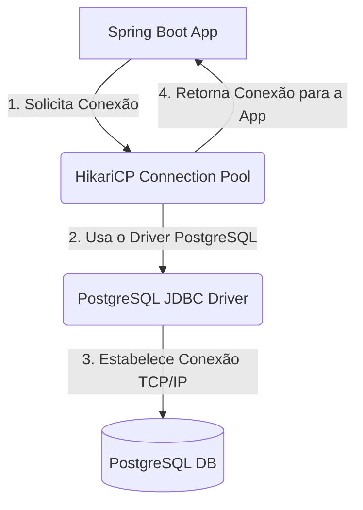
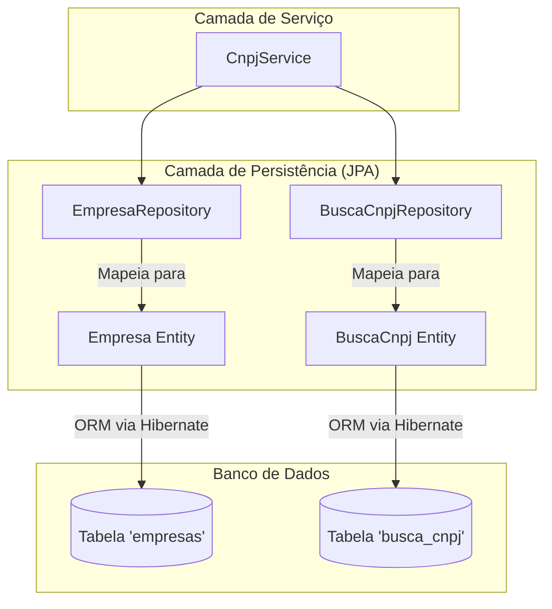
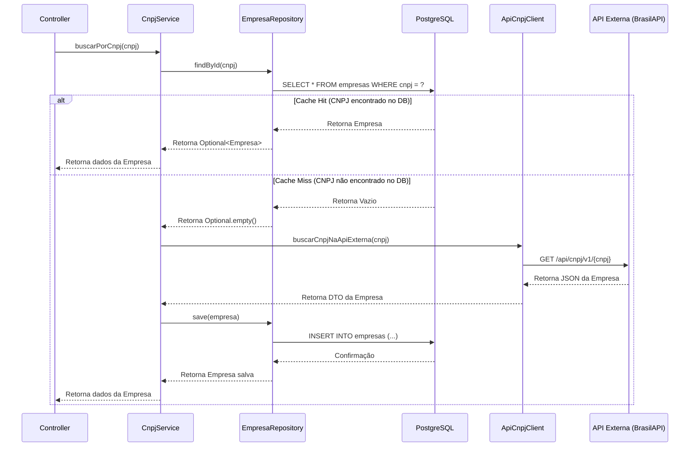

# Plano de Implementação Detalhado: Unificação do Serviço de Prospecção

Este documento serve como um guia técnico completo para o desenvolvimento do `prospecting-service`, com
 base no plano de Sprints fornecido.

---

## Sprint 1: Configuração do Ambiente e Base de Dados

### 1. Objetivo Técnico
O objetivo principal desta Sprint é migrar a camada de persistência da aplicação de um banco de dados em memória H2 para uma instância externa do PostgreSQL. Isso envolve a
 atualização das dependências do projeto, a reconfiguração dos parâmetros de conexão e a validação de que a aplicação pode iniciar e estabelecer uma conexão bem-sucedida com o PostgreSQL. Esta é uma etapa fundamental que prepara a base para as funcionalidades de persistência de dados das próximas Sprints.

### 2.
 Arquitetura
Esta Sprint altera a camada de dados da arquitetura. O banco de dados H2, que é incorporado e volátil, será substituído por um banco de dados PostgreSQL, que é externo, robusto e persistente. Isso representa uma evolução para um ambiente mais próximo da produção.

**
Diagrama de Fluxo de Conexão com o Banco (Mermaid):**



### 3. Pré-requisitos
- **Dependências**: Acesso de escrita ao arquivo `pom.xml` para gerenciar as dependências Maven.
- **Configurações**: Acesso de escrita ao arquivo `src/main/resources/application.yml` para alterar as configurações do Spring Boot.
- **Banco de Dados**: Uma instância do PostgreSQL deve estar em execução e acessível pela aplicação. O plano especifica a URL `jdbc:postgresql://db:5432/ragdb`, o que sugere um ambiente containerizado (ex: Docker) onde `db` é o nome do serviço do banco. O banco de dados `ragdb` deve ter sido criado previamente.
- **Variáveis de Ambiente**: Para seguir as boas práticas, as credenciais não devem ser fixas no código. As seguintes variáveis de ambiente devem ser configuradas no ambiente de execução:
  - `SPRING_DATASOURCE_URL`: URL de conexão JDBC.
  - `SPRING_DATASOURCE_USERNAME`: Nome de usuário do banco.
  - `SPRING_DATASOURCE_PASSWORD`: Senha do usuário do banco.

### 4. Ordem de implementação
1.  **Atualizar `pom.xml`**: O primeiro passo é adicionar a dependência do driver JDBC do PostgreSQL. Sem este driver, a aplicação não terá as classes necessárias para se comunicar com o banco, resultando em uma `ClassNotFoundException` na inicialização.
2.  **Remover dependência H2 (se aplicável)**: Para garantir que a aplicação utilize exclusivamente o PostgreSQL, a dependência `com.h2database:h2` deve ser removida do escopo de compilação/runtime. Se for necessária para testes, seu escopo deve ser explicitamente definido como `test`.
3.  **Configurar `application.yml`**: Com o driver disponível, o próximo passo é instruir o Spring Boot sobre como usá-lo. Isso é feito atualizando as propriedades `spring.datasource` para apontar para a instância do PostgreSQL, fornecendo a URL, o nome da classe do driver e as credenciais (preferencialmente via variáveis de ambiente).
4.  **Executar e Validar**: A etapa final é iniciar a aplicação. Isso serve como um teste de integração para toda a configuração. Os logs de inicialização devem ser inspecionados cuidadosamente para confirmar que o pool de conexões (HikariCP) foi criado com sucesso e está conectado ao PostgreSQL.

### 5. Arquivos envolvidos

| Arquivo | Criar ou Alterar | Responsabilidade |
| :--- | :--- | :--- |
| `pom.xml` | Alterar | Gerenciar as dependências do projeto, adicionando o driver do PostgreSQL e removendo/re-escopando o H2. |
| `src/main/resources/application.yml` | Alterar | Configurar a fonte de dados (`DataSource`) para conectar-se à instância do PostgreSQL. |

### 6. Implementação de cada classe
Nesta Sprint, não há criação de classes Java, apenas modificação de arquivos de configuração.

- **`pom.xml`**
  - **Responsabilidade**: Declarar as dependências do projeto.
  - **Alteração**: Adicionar a dependência do PostgreSQL.
  - **Código Sugerido**:
    ```xml
    <dependency>
        <groupId>org.postgresql</groupId>
        <artifactId>postgresql</artifactId>
        <scope>runtime</scope>
    </dependency>
    ```
    *Nota: Certifique-se de que a dependência do H2 (`com.h2database:h2`) seja removida ou tenha seu escopo alterado para `<scope>test</scope>`.*

- **`application.yml`**
  - **Responsabilidade**: Fornecer a configuração da aplicação, incluindo a fonte de dados.
  - **Alteração**: Substituir a configuração do H2 pela do PostgreSQL.
  - **Código Sugerido**:
    ```yaml
    spring:
      jpa:
        hibernate:
          # 'update' é aceitável para desenvolvimento inicial para que o Hibernate crie o schema.
          # Para produção, deve-se usar uma ferramenta de migração como Flyway ou Liquibase.
          ddl-auto: update
        show-sql: true # Útil para depuração em ambiente de desenvolvimento.
        properties:
          hibernate:
            dialect: org.hibernate.dialect.PostgreSQLDialect
      datasource:
        url: ${SPRING_DATASOURCE_URL:jdbc:postgresql://localhost:5432/ragdb}
        username: ${SPRING_DATASOURCE_USERNAME:postgres}
        password: ${SPRING_DATASOURCE_PASSWORD:postgres}
        driver-class-name: org.postgresql.Driver
    ```
    *Nota: O uso de `${VAR:default}` fornece um valor padrão caso a variável de ambiente não esteja definida, o que é útil para desenvolvimento local.*

### 7. Fluxo da aplicação
O fluxo relevante para esta Sprint é o de inicialização do Spring Boot:
1.  **Inicialização do Spring Boot**: A aplicação é iniciada.
2.  **Autoconfiguração**: O `DataSourceAutoConfiguration` do Spring Boot é ativado.
3.  **Leitura da Configuração**: O Spring lê as propriedades `spring.datasource` do `application.yml`.
4.  **Carregamento do Driver**: A classe `org.postgresql.Driver` é carregada pelo ClassLoader.
5.  **Criação do DataSource**: Um pool de conexões (HikariCP por padrão) é configurado com a URL, usuário e senha fornecidos.
6.  **Teste de Conexão**: O pool tenta estabelecer uma ou mais conexões iniciais com o banco de dados.
7.  **Log de Status**: A aplicação registra nos logs se a conexão foi bem-sucedida. O Hibernate também registrará o dialeto que está sendo usado.

### 8. Código sugerido
Os exemplos de código necessários já foram fornecidos na seção 6.

### 9. Testes
- **Teste Unitário/Integração**: Um teste de integração que carrega o contexto do Spring é a melhor forma de validar a configuração.
  - **Cenário Positivo**: A aplicação inicia, conecta-se ao banco e o teste passa.
  - **Cenário Negativo**: A aplicação falha ao iniciar devido a credenciais erradas, URL incorreta ou driver ausente.
  - **Código de Teste Sugerido**:
    ```java
    package com.example.prospecting;

    import org.junit.jupiter.api.Test;
    import org.springframework.beans.factory.annotation.Autowired;
    import org.springframework.boot.test.context.SpringBootTest;
    import javax.sql.DataSource;
    import java.sql.SQLException;
    import static org.assertj.core.api.Assertions.assertThat;

    @SpringBootTest
    class ProspectingServiceApplicationTests {

        @Autowired
        private DataSource dataSource;

        @Test
        void contextLoads() {
            assertThat(dataSource).isNotNull();
        }

        @Test
        void databaseConnectionIsPostgreSQL() throws SQLException {
            String databaseProductName = dataSource.getConnection().getMetaData().getDatabaseProductName();
            assertThat(databaseProductName).isEqualTo("PostgreSQL");
        }
    }
    ```

### 10. Critérios de aceite
- O `pom.xml` contém a dependência `org.postgresql:postgresql` com escopo `runtime`.
- O `application.yml` está configurado para usar o driver `org.postgresql.Driver` e a URL JDBC do PostgreSQL.
- A aplicação inicia com sucesso, sem exceções de conexão (`ConnectionException`) ou de classe não encontrada (`ClassNotFoundException`) relacionadas ao banco de dados.
- Os logs de inicialização do Hibernate confirmam o uso do dialeto `org.hibernate.dialect.PostgreSQLDialect`.

### 11. Possíveis riscos
- **Risco de Integração**: A aplicação não consegue se conectar ao banco por problemas de rede (ex: firewall, configuração de rede do Docker).
  - **Mitigação**: Isolar o problema testando a conectividade da máquina de desenvolvimento ao host do banco de dados usando uma ferramenta de linha de comando como `psql` ou `telnet` antes de executar a aplicação.
- **Risco de Configuração**: Credenciais, nome do banco ou host da URL de conexão estão incorretos.
  - **Mitigação**: Adotar o uso de variáveis de ambiente e, para produção, um sistema de gerenciamento de segredos (ex: Vault, AWS/GCP Secret Manager). Validar as credenciais manualmente.

### 12. Checklist da Sprint
- [ ] Dependência `org.postgresql:postgresql` adicionada ao `pom.xml`.
- [ ] Dependência `com.h2database:h2` removida ou com escopo de teste.
- [ ] `application.yml` atualizado com as configurações do PostgreSQL.
- [ ] Aplicação inicia com sucesso.
- [ ] Logs confirmam a conexão com o PostgreSQL e o uso do dialeto correto.
- [ ] Teste de integração de contexto (`contextLoads`) passa.

---

## Sprint 2: Criação das Entidades e Repositórios JPA

### 1. Objetivo Técnico
O objetivo é estabelecer a camada de persistência da aplicação através da definição do modelo de dados com Entidades JPA (`Empresa`, `BuscaCnpj`) e da criação das interfaces de repositório correspondentes. Isso permitirá que a lógica de negócio interaja com o banco de dados de forma padronizada, orientada a objetos e com baixo acoplamento, utilizando o poder do Spring Data JPA.

### 2. Arquitetura
Esta Sprint constrói sobre a camada de dados configurada na Sprint 1. As Entidades JPA formalizam o Mapeamento Objeto-Relacional (ORM), traduzindo classes Java em tabelas de banco de dados. Os Repositórios implementam o padrão Data Access Object (DAO), fornecendo uma API de alto nível para manipulação de dados.

**Diagrama da Camada de Persistência (Mermaid):**


### 3. Pré-requisitos
- **Sprint 1 Concluída**: A conexão com o banco de dados PostgreSQL deve estar estável e funcionando.
- **Dependências**: O projeto deve incluir a dependência `spring-boot-starter-data-jpa`.
- **Configuração do Hibernate**: A propriedade `spring.jpa.hibernate.ddl-auto` deve estar configurada como `update` no `application.yml` para permitir que o Hibernate crie ou atualize o schema do banco de dados com base nas entidades.

### 4. Ordem de implementação
1.  **Criar a entidade `Empresa.java`**: Começar pelo modelo de dados principal é a abordagem mais lógica. Esta entidade representa os dados de uma empresa e será o "prêmio" da nossa prospecção.
2.  **Criar a entidade `BuscaCnpj.java`**: Em seguida, criar a entidade que representa a "fila" de trabalho. É uma estrutura mais simples e sua criação é direta.
3.  **Criar o repositório `EmpresaRepository.java`**: Com a entidade `Empresa` definida, podemos criar sua interface de acesso a dados. Isso desacopla a lógica de negócio dos detalhes de implementação da persistência.
4.  **Criar o repositório `BuscaCnpjRepository.java`**: Da mesma forma, criar o repositório para a entidade `BuscaCnpj`.
5.  **Validar a Criação do Schema**: Iniciar a aplicação. Este passo é crucial para validar se o mapeamento objeto-relacional está correto. Após a inicialização, deve-se conectar ao banco de dados com um cliente SQL e verificar se as tabelas `empresas` e `busca_cnpj` foram criadas com as colunas, tipos e restrições esperadas.

### 5. Arquivos envolvidos

| Arquivo | Criar ou Alterar | Responsabilidade |
| :--- | :--- | :--- |
| `src/main/java/.../entity/Empresa.java` | Criar | Representa a entidade `Empresa`, mapeada para a tabela `empresas`. Contém os dados detalhados de um CNPJ. |
| `src/main/java/.../repository/EmpresaRepository.java` | Criar | Interface Spring Data JPA para realizar operações CRUD na entidade `Empresa`. |
| `src/main/java/.../entity/BuscaCnpj.java` | Criar | Representa um CNPJ na fila de processamento em lote, mapeado para a tabela `busca_cnpj`. |
| `src/main/java/.../repository/BuscaCnpjRepository.java` | Criar | Interface Spring Data JPA para realizar operações CRUD na entidade `BuscaCnpj`. |

### 6. Implementação de cada classe

- **`Empresa.java`**
  - **Responsabilidade**: Modelar os dados de uma empresa. Atua como a representação persistente dos dados que vêm da BrasilAPI.
  - **Anotações**: `@Entity`, `@Table(name = "empresas")`, `@Id`, `@Column`.
  - **Boas Práticas**:
    - Usar `String` para o CNPJ (`@Id`) para preservar zeros à esquerda.
    - Usar `java.time.LocalDate` para campos de data.
    - Usar Lombok (`@Data`, `@Builder`, `@NoArgsConstructor`, `@AllArgsConstructor`) para reduzir código boilerplate.
  - **Código Sugerido**:
    ```java
    package com.example.prospecting.entity;

    import jakarta.persistence.Column;
    import jakarta.persistence.Entity;
    import jakarta.persistence.Id;
    import jakarta.persistence.Table;
    import lombok.AllArgsConstructor;
    import lombok.Builder;
    import lombok.Data;
    import lombok.NoArgsConstructor;

    import java.time.LocalDate;

    @Data
    @Builder
    @NoArgsConstructor
    @AllArgsConstructor
    @Entity
    @Table(name = "empresas")
    public class Empresa {

        @Id
        @Column(length = 14)
        private String cnpj;

        @Column(name = "razao_social")
        private String razaoSocial;

        @Column(name = "nome_fantasia")
        private String nomeFantasia;
        
        // Adicionar outros campos relevantes da BrasilAPI...
    }
    ```

- **`EmpresaRepository.java`**
  - **Responsabilidade**: Fornecer uma abstração para acessar os dados da tabela `empresas`.
  - **Anotações**: `@Repository` (opcional, pois estender `JpaRepository` já é suficiente).
  - **Código Sugerido**:
    ```java
    package com.example.prospecting.repository;

    import com.example.prospecting.entity.Empresa;
    import org.springframework.data.jpa.repository.JpaRepository;
    import org.springframework.stereotype.Repository;

    @Repository
    public interface EmpresaRepository extends JpaRepository<Empresa, String> {
    }
    ```

- **`BuscaCnpj.java`**
  - **Responsabilidade**: Modelar um CNPJ que precisa ser processado.
  - **Anotações**: `@Entity`, `@Table(name = "busca_cnpj")`, `@Id`, `@GeneratedValue`.
  - **Código Sugerido**:
    ```java
    package com.example.prospecting.entity;

    import jakarta.persistence.*;
    import lombok.Data;

    @Data
    @Entity
    @Table(name = "busca_cnpj")
    public class BuscaCnpj {

        @Id
        @GeneratedValue(strategy = GenerationType.IDENTITY)
        private Long id;

        @Column(nullable = false, unique = true, length = 14)
        private String cnpj;
    }
    ```

- **`BuscaCnpjRepository.java`**
  - **Responsabilidade**: Fornecer uma abstração para acessar a lista de CNPJs a serem processados.
  - **Código Sugerido**:
    ```java
    package com.example.prospecting.repository;

    import com.example.prospecting.entity.BuscaCnpj;
    import org.springframework.data.jpa.repository.JpaRepository;
    import org.springframework.stereotype.Repository;

    @Repository
    public interface BuscaCnpjRepository extends JpaRepository<BuscaCnpj, Long> {
    }
    ```

### 7. Fluxo da aplicação
O fluxo principal desta Sprint é o de inicialização e validação do schema:
1.  **Inicialização do Spring Boot**: A aplicação inicia.
2.  **Inicialização do JPA/Hibernate**: O Hibernate escaneia o classpath em busca de classes anotadas com `@Entity`.
3.  **Geração do Schema**: Com base nas entidades `Empresa` e `BuscaCnpj` e na configuração `ddl-auto: update`, o Hibernate gera as instruções SQL DDL (`CREATE TABLE`, `ALTER TABLE`).
4.  **Execução do DDL**: O Hibernate executa o SQL contra o banco de dados PostgreSQL.
5.  **Criação dos Proxies de Repositório**: O Spring Data JPA cria implementações em tempo de execução (proxies) para as interfaces `EmpresaRepository` e `BuscaCnpjRepository`.
6.  **Aplicação Pronta**: A aplicação está pronta, com as tabelas criadas e os repositórios disponíveis para injeção de dependência.

### 8. Código sugerido
Os exemplos de código já foram fornecidos na seção 6.

### 9. Testes
- **Testes de Integração**: O foco é testar a camada de persistência de forma isolada.
  - **Ferramenta**: `@DataJpaTest`. Esta anotação configura um contexto de teste focado na persistência, desabilitando a maior parte da autoconfiguração. Por padrão, usa um banco em memória, mas pode ser configurado para usar um banco de dados real (idealmente com Testcontainers).
  - **Cenário Positivo**:
    1.  Criar um teste com `@DataJpaTest`.
    2.  Injetar o `EmpresaRepository`.
    3.  Criar uma instância de `Empresa`, salvá-la com `repository.save()`.
    4.  Buscar a empresa pelo ID e verificar se os dados retornados são idênticos aos que foram salvos.
  - **Exemplo de Teste**:
    ```java
    import org.springframework.boot.test.autoconfigure.orm.jpa.TestEntityManager;

    @DataJpaTest
    // Para usar um BD de teste real (ex: com Testcontainers), descomente a linha abaixo
    // @AutoConfigureTestDatabase(replace = AutoConfigureTestDatabase.Replace.NONE) 
    class EmpresaRepositoryTest {

        @Autowired
        private TestEntityManager entityManager;

        @Autowired
        private EmpresaRepository empresaRepository;

        @Test
        void whenFindById_thenReturnEmpresa() {
            // given
            Empresa empresa = Empresa.builder().cnpj("12345678000195").razaoSocial("Teste SA").build();
            entityManager.persist(empresa);
            entityManager.flush();

            // when
            Optional<Empresa> found = empresaRepository.findById(empresa.getCnpj());

            // then
            assertThat(found).isPresent();
            assertThat(found.get().getRazaoSocial()).isEqualTo(empresa.getRazaoSocial());
        }
    }
    ```

### 10. Critérios de aceite
- Os arquivos `Empresa.java` e `BuscaCnpj.java` existem no pacote `entity` com o mapeamento JPA correto.
- Os arquivos `EmpresaRepository.java` e `BuscaCnpjRepository.java` existem no pacote `repository`.
- Ao iniciar a aplicação, as tabelas `empresas` e `busca_cnpj` são criadas corretamente no PostgreSQL.
- Testes de integração (`@DataJpaTest`) para ambos os repositórios foram criados e passam com sucesso, validando as operações de salvar e buscar.

### 11. Possíveis riscos
- **Risco Técnico**: Mapeamento incorreto entre tipos Java e tipos de coluna do PostgreSQL (ex: `String` muito curto, tipo de data errado).
  - **Mitigação**: Testar a persistência com `@DataJpaTest` e especificar o `length` em colunas `@Column` quando apropriado.
- **Risco de Configuração**: O uso de `ddl-auto: update` em produção pode levar a um estado inconsistente do schema. Em desenvolvimento, `create` ou `create-drop` podem apagar dados inesperadamente.
  - **Mitigação**: Usar `update` apenas no início do desenvolvimento. Adotar uma ferramenta de migração de banco de dados como **Flyway** ou **Liquibase** o mais cedo possível. Para produção, `ddl-auto` deve ser `none` ou `validate`.

### 12. Checklist da Sprint
- [ ] Arquivo `entity/Empresa.java` criado.
- [ ] Arquivo `repository/EmpresaRepository.java` criado.
- [ ] Arquivo `entity/BuscaCnpj.java` criado.
- [ ] Arquivo `repository/BuscaCnpjRepository.java` criado.
- [ ] Aplicação inicia e cria/atualiza as tabelas `empresas` e `busca_cnpj`.
- [ ] Testes de integração para `EmpresaRepository` criados e passando.
- [ ] Testes de integração para `BuscaCnpjRepository` criados e passando.

---

## Sprint 3: Migração e Adaptação da Lógica de Negócio

### 1. Objetivo Técnico

O objetivo desta Sprint é implementar a lógica de negócio principal do serviço de prospecção. Isso inclui a criação de um cliente para consumir a API externa de CNPJ e a implementação do padrão de cache *Cache-Aside* no serviço principal. Ao receber uma requisição para um CNPJ, o serviço primeiro buscará no banco de dados local (cache) e, somente se não encontrar, consultará a API externa, salvando o resultado para futuras consultas.

### 2. Arquitetura
Esta Sprint introduz a camada de serviço e a interação com um sistema externo. A arquitetura agora inclui um fluxo de dados condicional.

**Diagrama de Fluxo de Requisição (Cache-Aside Pattern):**


### 3. Pré-requisitos
- **Sprint 2 Concluída**: Entidades e repositórios JPA devem estar funcionando.
- **Dependências**: `spring-boot-starter-web` para o `RestClient`.
- **API Externa**: A URL base da BrasilAPI (`https://brasilapi.com.br`) deve ser conhecida e acessível.

### 4. Ordem de implementação
1.  **Criar `ApiCnpjClient`**: Isolar a lógica de acesso à API externa em um componente dedicado (`@Service` ou `@Component`). É a primeira etapa pois o `CnpjService` dependerá dele. O uso do `RestClient` do Spring 6 é a abordagem moderna e preferível.
2.  **Criar DTOs para a API**: Criar classes (preferencialmente `records`) que representem a estrutura do JSON retornado pela BrasilAPI. Isso garante uma desserialização segura e tipada.
3.  **Refatorar `CnpjService`**: Com o cliente da API pronto, a lógica principal pode ser implementada. O serviço será modificado para orquestrar a busca: primeiro no `EmpresaRepository` e, em caso de falha, no `ApiCnpjClient`.
4.  **Implementar o fluxo de "Cache Miss"**: No `CnpjService`, após receber os dados do `ApiCnpjClient`, é preciso converter o DTO da API para a entidade `Empresa` e salvá-la usando o `EmpresaRepository`.
5.  **Adaptar o `CnpjController`**: Garantir que o controller chame o método `buscarPorCnpj` do serviço e retorne uma resposta adequada (200 OK com dados ou 404 Not Found).
6.  **Testar o fluxo completo**: Criar testes de integração que validem os cenários de "cache hit" e "cache miss".

### 5. Arquivos envolvidos

| Arquivo | Criar ou Alterar | Responsabilidade |
| :--- | :--- | :--- |
| `src/main/java/.../client/ApiCnpjClient.java` | Criar | Isola a comunicação com a API externa (BrasilAPI) para busca de dados de CNPJ. |
| `src/main/java/.../client/dto/BrasilApiEmpresaDTO.java` | Criar | DTO (Data Transfer Object) que mapeia a resposta JSON da BrasilAPI. |
| `src/main/java/.../service/CnpjService.java` | Alterar | Orquestra a busca de CNPJ, implementando o padrão Cache-Aside. |
| `src/main/java/.../controller/CnpjController.java` | Alterar | Expõe o endpoint `GET /cnpj/{cnpj}` e lida com as respostas HTTP. |
| `src/main/java/.../mapper/EmpresaMapper.java` | Criar (Opcional) | (Boa prática) Converte o DTO da API (`BrasilApiEmpresaDTO`) para a entidade (`Empresa`). |

### 6. Implementação de cada classe

- **`ApiCnpjClient.java`**
  - **Responsabilidade**: Realizar chamadas HTTP para a BrasilAPI.
  - **Anotações**: `@Service`.
  - **Dependências**: `RestClient`.
  - **Boas Práticas**: Configurar o `RestClient` como um `Bean` para centralizar configurações como URL base, timeouts e headers.
  - **Código Sugerido**:
    ```java
    // Em uma classe de configuração @Configuration
    @Bean
    public RestClient brasilApiRestClient(@Value("${brasilapi.base-url}") String baseUrl) {
        return RestClient.builder()
                .baseUrl(baseUrl)
                .defaultHeader(HttpHeaders.ACCEPT, MediaType.APPLICATION_JSON_VALUE)
                .build();
    }

    // No cliente
    @Service
    public class ApiCnpjClient {
        private final RestClient restClient;

        public ApiCnpjClient(RestClient brasilApiRestClient) {
            this.restClient = brasilApiRestClient;
        }

        public Optional<BrasilApiEmpresaDTO> fetchEmpresa(String cnpj) {
            try {
                BrasilApiEmpresaDTO empresa = restClient.get()
                        .uri("/api/cnpj/v1/{cnpj}", cnpj)
                        .retrieve()
                        .body(BrasilApiEmpresaDTO.class);
                return Optional.ofNullable(empresa);
            } catch (HttpClientErrorException.NotFound e) {
                // CNPJ não encontrado na API externa
                return Optional.empty();
            }
        }
    }
    ```

- **`BrasilApiEmpresaDTO.java`**
  - **Responsabilidade**: Representar os dados da empresa como retornados pela BrasilAPI.
  - **Boas Práticas**: Usar `record` para imutabilidade e concisão. Usar `@JsonAlias` ou `@JsonProperty` para mapear nomes de campos diferentes.
  - **Código Sugerido**:
    ```java
    import com.fasterxml.jackson.annotation.JsonProperty;

    public record BrasilApiEmpresaDTO(
        String cnpj,
        @JsonProperty("razao_social") String razaoSocial,
        @JsonProperty("nome_fantasia") String nomeFantasia
        // outros campos...
    ) {}
    ```

- **`CnpjService.java`**
  - **Responsabilidade**: Orquestrar a busca de CNPJ, aplicando a lógica de cache.
  - **Dependências**: `EmpresaRepository`, `ApiCnpjClient`, `EmpresaMapper`.
  - **Tratamento de Exceções**: O método deve retornar `Optional<Empresa>` para indicar claramente a ausência de um resultado, que será tratado pelo controller.
  - **Código Sugerido**:
    ```java
    @Service
    @RequiredArgsConstructor // Lombok
    public class CnpjService {
        private final EmpresaRepository empresaRepository;
        private final ApiCnpjClient apiCnpjClient;
        private final EmpresaMapper empresaMapper; // Usando MapStruct

        @Transactional
        public Optional<Empresa> buscarPorCnpj(String cnpj) {
            // 1. Tenta buscar no banco de dados (cache)
            Optional<Empresa> empresaOpt = empresaRepository.findById(cnpj);
            if (empresaOpt.isPresent()) {
                // Cache Hit
                return empresaOpt;
            }

            // 2. Cache Miss: busca na API externa
            return apiCnpjClient.fetchEmpresa(cnpj)
                    .map(empresaMapper::toEntity) // 3. Converte DTO para Entidade
                    .map(empresaRepository::save); // 4. Salva no banco e retorna
        }
    }
    ```

### 7. Fluxo da aplicação
1.  **Controller**: O `CnpjController` recebe uma requisição `GET /cnpj/{cnpj}`.
2.  **Service**: O controller chama `cnpjService.buscarPorCnpj(cnpj)`.
3.  **Repository (Cache Read)**: O serviço tenta buscar o CNPJ no `empresaRepository`.
4.  **Cenário 1: Cache Hit**: Se o repositório retorna uma `Empresa`, o serviço a retorna para o controller, que responde com `200 OK` e o corpo da empresa.
5.  **Cenário 2: Cache Miss**: Se o repositório retorna vazio:
    a.  **API Client**: O serviço chama o `apiCnpjClient` para buscar na API externa.
    b.  **API Externa**: O cliente faz a chamada HTTP.
    c.  **Persistência**: Se a API externa retorna dados, o serviço os converte para a entidade `Empresa` e a salva no `empresaRepository`.
    d.  **Retorno**: A entidade recém-salva é retornada ao controller, que responde com `200 OK`.
6.  **Cenário 3: Não Encontrado**: Se o CNPJ não existe nem no banco nem na API externa, o serviço retorna um `Optional` vazio, e o controller responde com `404 Not Found`.

### 8. Código sugerido
Os exemplos de código já foram fornecidos na seção 6.

### 9. Testes
- **Testes de Integração (`@SpringBootTest`)**: Essenciais para testar o fluxo completo.
  - **Mocks Necessários**: A API externa deve ser mockada usando `MockRestServiceServer` ou WireMock para evitar chamadas reais e tornar os testes determinísticos. O banco de dados pode ser o de teste (H2 ou Testcontainers).
  - **Cenário "Cache Miss"**:
    1.  Garantir que o CNPJ não existe no banco.
    2.  Mockar a resposta da API externa para retornar sucesso com dados de uma empresa.
    3.  Chamar o endpoint `GET /cnpj/{cnpj}`.
    4.  Verificar se a resposta é `200 OK`.
    5.  Verificar se o `apiCnpjClient` foi chamado 1 vez.
    6.  Verificar se o `empresaRepository.save()` foi chamado 1 vez.
    7.  Verificar se o CNPJ agora existe no banco.
  - **Cenário "Cache Hit"**:
    1.  Inserir um CNPJ no banco de dados antes do teste.
    2.  Chamar o endpoint `GET /cnpj/{cnpj}`.
    3.  Verificar se a resposta é `200 OK`.
    4.  Verificar se o `apiCnpjClient` **não** foi chamado.
    5.  Verificar se os dados retornados correspondem aos que estavam no banco.

### 10. Critérios de aceite
- Ao chamar `GET /cnpj/{cnpj}` para um CNPJ inédito, uma chamada à API externa é realizada, e os dados são salvos no banco.
- Ao chamar `GET /cnpj/{cnpj}` para o mesmo CNPJ uma segunda vez, nenhuma chamada à API externa é feita, e os dados são lidos diretamente do banco.
- Se um CNPJ não existe na API externa, o endpoint retorna `HTTP 404 Not Found`.
- O código de acesso à API externa está isolado no `ApiCnpjClient`.

### 11. Possíveis riscos
- **Risco de Integração**: A API externa pode estar fora do ar, lenta ou mudar seu contrato (schema do JSON).
  - **Mitigação**:
    - **Timeouts**: Configurar timeouts de conexão e leitura no `RestClient`.
    - **Resilience4j**: Implementar padrões como Circuit Breaker para parar de chamar a API se ela estiver falhando repetidamente.
    - **Monitoramento e Alertas**: Monitorar a taxa de erro das chamadas à API.
- **Risco de Performance**: Chamadas síncronas à API externa podem degradar a performance da aplicação se a API for lenta.
  - **Mitigação**: Para endpoints de alta demanda, considerar o uso de programação reativa (WebFlux) ou chamadas assíncronas (`@Async`). Para o caso de uso atual, a abordagem síncrona com cache é provavelmente suficiente.

### 12. Checklist da Sprint
- [ ] `ApiCnpjClient` criado e configurado.
- [ ] DTO para a resposta da BrasilAPI criado.
- [ ] `CnpjService` refatorado com a lógica de Cache-Aside.
- [ ] Teste de integração para o cenário "Cache Miss" criado e passando.
- [ ] Teste de integração para o cenário "Cache Hit" criado e passando.
- [ ] Teste de integração para o cenário "CNPJ não encontrado" criado e passando.
- [ ] Endpoint `GET /cnpj/{cnpj}` funcionando conforme esperado.

---

## Sprint 4: Implementação dos Novos Modos de Consulta

### 1. Objetivo Técnico
O objetivo é expandir as capacidades do serviço além da consulta sob demanda, adicionando funcionalidades proativas de prospecção: um endpoint para processamento em lote de uma lista de CNPJs e uma tarefa agendada (`@Scheduled`) para executar esse processamento em lote automaticamente em intervalos definidos.

### 2. Arquitetura
Esta Sprint introduz dois novos gatilhos para a lógica de negócio existente: um gatilho manual via endpoint REST e um gatilho temporal via scheduler do Spring. A lógica central (`CnpjService.buscarPorCnpj`) implementada na Sprint 3 será reutilizada.

**Diagrama de Fluxo de Gatilhos:**
```mermaid
graph TD
    subgraph "Gatilhos"
        A[POST /cnpj/processar-lote]
        B{Scheduler @Scheduled}
    end
    
    subgraph "Camada de Serviço"
        C[CnpjController]
        D[ScheduledProspectingTask]
        E[CnpjService]
    end

    subgraph "Camada de Persistência"
        F[BuscaCnpjRepository]
    end

    A --> C
    B --> D
    C --> E: processarLoteDeCnpjs()
    D --> E: processarLoteDeCnpjs()
    E --> F: findAll()
    F --> E: Retorna Lista de CNPJs
    E -- Para cada CNPJ --> E: buscarPorCnpj(cnpj)
```

### 3. Pré-requisitos
- **Sprint 3 Concluída**: A lógica de `CnpjService.buscarPorCnpj` deve estar robusta e testada.
- **Entidades**: A entidade `BuscaCnpj` e o repositório `BuscaCnpjRepository` devem existir.
- **Configuração**: A anotação `@EnableScheduling` precisa ser adicionada à classe principal da aplicação ou a uma classe de configuração.

### 4. Ordem de implementação
1.  **Habilitar Agendamento**: Adicionar `@EnableScheduling` na classe principal da aplicação. É um passo simples e pré-requisito para a tarefa agendada.
2.  **Implementar `processarLoteDeCnpjs()` no `CnpjService`**: Criar o método que conterá a lógica de lote. Ele deve:
    a. Buscar todos os CNPJs da tabela `busca_cnpj` usando `buscaCnpjRepository.findAll()`.
    b. Iterar sobre a lista e, para cada item, chamar o método `buscarPorCnpj(cnpj)` já existente.
    c. (Opcional, mas recomendado) Adicionar logging para indicar o início, progresso e fim do processo.
3.  **Criar o Endpoint de Lote**: No `CnpjController`, adicionar um novo método mapeado para `POST /cnpj/processar-lote` que simplesmente chama `cnpjService.processarLoteDeCnpjs()`. A resposta pode ser um `202 Accepted` para indicar que o processo foi iniciado.
4.  **Criar a Tarefa Agendada (`ScheduledProspectingTask`)**: Criar um novo componente (`@Component`) com um método anotado com `@Scheduled`. Este método chamará `cnpjService.processarLoteDeCnpjs()`. A expressão `cron` definirá a frequência da execução.
5.  **Testar**: Testar o endpoint de lote e a tarefa agendada. O teste da tarefa agendada pode ser mais complexo e exigir técnicas específicas para não depender do tempo real.

### 5. Arquivos envolvidos

| Arquivo | Criar ou Alterar | Responsabilidade |
| :--- | :--- | :--- |
| `src/main/java/.../ProspectingServiceApplication.java` | Alterar | Adicionar `@EnableScheduling` para habilitar a execução de tarefas agendadas. |
| `src/main/java/.../service/CnpjService.java` | Alterar | Adicionar o método `processarLoteDeCnpjs()` para orquestrar a busca em lote. |
| `src/main/java/.../controller/CnpjController.java` | Alterar | Adicionar o endpoint `POST /cnpj/processar-lote` para disparar o processamento em lote. |
| `src/main/java/.../task/ScheduledProspectingTask.java` | Criar | Componente que contém a lógica agendada (`@Scheduled`) para executar o processamento em lote. |

### 6. Implementação de cada classe

- **`CnpjService.java` (adição)**
  - **Responsabilidade do novo método**: Ler a lista de CNPJs da tabela `busca_cnpj` e disparar a prospecção para cada um, reutilizando a lógica existente.
  - **Boas Práticas**:
    - O processamento pode ser demorado. Executá-lo de forma assíncrona (`@Async`) é uma boa prática para não bloquear a thread do scheduler ou do controller.
    - Adicionar logs detalhados.
    - Considerar o que fazer com os CNPJs após o processamento (apagá-los da tabela `busca_cnpj` ou marcá-los como processados).
  - **Código Sugerido**:
    ```java
    @Service
    @RequiredArgsConstructor
    @Slf4j // Lombok para logging
    public class CnpjService {
        // ... outros métodos e dependências

        private final BuscaCnpjRepository buscaCnpjRepository;

        @Async // Requer @EnableAsync na aplicação
        public void processarLoteDeCnpjs() {
            log.info("Iniciando processamento em lote de CNPJs...");
            List<BuscaCnpj> cnpjsParaBuscar = buscaCnpjRepository.findAll();
            
            log.info("Encontrados {} CNPJs para processar.", cnpjsParaBuscar.size());

            for (BuscaCnpj busca : cnpjsParaBuscar) {
                try {
                    buscarPorCnpj(busca.getCnpj());
                    // Após sucesso, remove da lista para não reprocessar
                    buscaCnpjRepository.delete(busca);
                } catch (Exception e) {
                    log.error("Falha ao processar CNPJ {} do lote: {}", busca.getCnpj(), e.getMessage());
                    // Decidir estratégia: deixar na tabela para tentar de novo? Mover para uma tabela de "falhas"?
                }
            }
            log.info("Processamento em lote finalizado.");
        }
    }
    ```

- **`CnpjController.java` (adição)**
  - **Responsabilidade do novo método**: Expor um endpoint para acionar o processamento em lote manualmente.
  - **Boas Práticas**: Como o processo é assíncrono, retornar `202 Accepted` é semanticamente correto, indicando que a requisição foi aceita para processamento, mas não concluída.
  - **Código Sugerido**:
    ```java
    @RestController
    @RequestMapping("/cnpj")
    @RequiredArgsConstructor
    public class CnpjController {
        // ... outro método

        private final CnpjService cnpjService;

        @PostMapping("/processar-lote")
        public ResponseEntity<Void> processarLote() {
            cnpjService.processarLoteDeCnpjs();
            return ResponseEntity.accepted().build();
        }
    }
    ```

- **`ScheduledProspectingTask.java`**
  - **Responsabilidade**: Executar o processamento em lote em uma frequência definida.
  - **Anotações**: `@Component`, `@Scheduled`.
  - **Boas Práticas**: A expressão `cron` deve ser externalizada para o `application.yml` para ser facilmente configurável por ambiente.
  - **Código Sugerido**:
    ```java
    package com.example.prospecting.task;

    import com.example.prospecting.service.CnpjService;
    import lombok.RequiredArgsConstructor;
    import lombok.extern.slf4j.Slf4j;
    import org.springframework.scheduling.annotation.Scheduled;
    import org.springframework.stereotype.Component;

    @Component
    @RequiredArgsConstructor
    @Slf4j
    public class ScheduledProspectingTask {

        private final CnpjService cnpjService;

        // Executa todo dia às 2 da manhã
        @Scheduled(cron = "${prospecting.schedule.cron:0 0 2 * * ?}")
        public void executarProspeccaoAgendada() {
            log.info("Disparando tarefa agendada de prospecção de CNPJs.");
            cnpjService.processarLoteDeCnpjs();
        }
    }
    ```

### 7. Fluxo da aplicação
- **Fluxo via Endpoint**:
  1.  Uma requisição `POST` chega em `/cnpj/processar-lote`.
  2.  O `CnpjController` chama `cnpjService.processarLoteDeCnpjs()`.
  3.  O serviço (em uma thread separada se `@Async` for usado) busca todos os `BuscaCnpj` no banco.
  4.  Para cada `BuscaCnpj`, ele chama o método `buscarPorCnpj`, que executa a lógica de cache-aside da Sprint 3.
- **Fluxo via Scheduler**:
  1.  O Spring Scheduler, no horário definido pelo `cron`, invoca o método `executarProspeccaoAgendada()` em `ScheduledProspectingTask`.
  2.  O método então chama `cnpjService.processarLoteDeCnpjs()`.
  3.  O fluxo a partir daqui é idêntico ao do endpoint.

### 8. Código sugerido
Os exemplos de código já foram fornecidos na seção 6.

### 9. Testes
- **Teste de Integração para o Endpoint de Lote**:
  - **Cenário**:
    1.  Popular a tabela `busca_cnpj` com alguns CNPJs.
    2.  Mockar a API externa para retornar sucesso para esses CNPJs.
    3.  Chamar `POST /cnpj/processar-lote`.
    4.  Verificar se a resposta é `202 Accepted`.
    5.  Aguardar a conclusão do processamento assíncrono (usando Awaitility, por exemplo).
    6.  Verificar se a tabela `busca_cnpj` está vazia.
    7.  Verificar se os dados dos CNPJs foram salvos na tabela `empresas`.
- **Teste para a Tarefa Agendada**:
  - Testar `cron` é complexo. A melhor abordagem é testar a lógica do método público que o scheduler chama.
  - Uma abordagem para testar o agendamento em si é usar a biblioteca ShedLock para garantir que a tarefa não execute em múltiplos nós e fornece utilitários de teste. Outra é usar `@TestPropertySource` para definir um `cron` que rode a cada segundo e verificar se o método foi chamado, mas isso pode tornar o teste instável. A abordagem mais simples é confiar que o Spring funciona e testar apenas a lógica interna.

### 10. Critérios de aceite
- Uma requisição `POST` para `/cnpj/processar-lote` inicia a busca para todos os CNPJs na tabela `busca_cnpj`.
- A tarefa agendada é executada no horário configurado no `application.yml`.
- Após o processamento (seja via endpoint ou agendado), os CNPJs processados com sucesso são removidos da tabela `busca_cnpj`.
- Os logs da aplicação mostram o início, progresso e fim do processamento em lote.

### 11. Possíveis riscos
- **Risco de Performance**: Processar um lote muito grande de CNPJs pode consumir muitos recursos (CPU, memória, conexões de banco) e demorar muito tempo.
  - **Mitigação**: Processar o lote em `chunks` (pedaços), usando paginação (`PagingAndSortingRepository`). Implementar o processamento assíncrono (`@Async`) para não bloquear a thread principal.
- **Risco de Concorrência**: A tarefa agendada pode começar a rodar enquanto um processamento manual ainda está em execução (ou vice-versa).
  - **Mitigação**: Usar um mecanismo de lock. A biblioteca **ShedLock** é excelente para isso, garantindo que uma tarefa agendada só possa ser executada uma vez por vez, mesmo em um ambiente com múltiplos nós.
- **Risco de Falha Parcial**: Se a aplicação cair no meio do processamento, como saber o que já foi processado?
  - **Mitigação**: A estratégia de apagar o CNPJ da tabela `busca_cnpj` somente após o sucesso do processamento individual já mitiga isso. Quando a aplicação voltar, ela tentará reprocessar apenas os que não foram concluídos.

### 12. Checklist da Sprint
- [ ] `@EnableScheduling` e `@EnableAsync` adicionados à classe da aplicação.
- [ ] Método `processarLoteDeCnpjs` implementado no `CnpjService`.
- [ ] Endpoint `POST /cnpj/processar-lote` criado no `CnpjController`.
- [ ] Componente `ScheduledProspectingTask` com o método `@Scheduled` criado.
- [ ] Teste de integração para o endpoint de lote criado e passando.
- [ ] A expressão `cron` do scheduler está externalizada no `application.yml`.

---

## Sprint 5: Finalização, Testes e Documentação

### 1. Objetivo Técnico
O objetivo desta Sprint é garantir que a aplicação esteja com qualidade de produção. Isso envolve a criação de uma suíte de testes de integração abrangente, a refatoração e limpeza de código obsoleto, e a criação de uma documentação clara e concisa para que outros desenvolvedores possam entender e utilizar o serviço.

### 2. Arquitetura
Esta Sprint não introduz novas funcionalidades arquiteturais, mas foca em solidificar e validar a arquitetura existente. A criação de testes de integração robustos valida as interações entre as camadas (Controller, Service, Repository) e com sistemas externos (banco de dados, API mockada). A documentação serve para comunicar a arquitetura e o uso da API.

### 3. Pré-requisitos
- **Sprints 1-4 Concluídas**: Todas as funcionalidades principais devem estar implementadas.

### 4. Ordem de implementação
1.  **Escrever Testes de Integração**: Focar nos fluxos de negócio de ponta a ponta (do controller ao banco de dados). Usar `@SpringBootTest` com um servidor web mockado (`RANDOM_PORT` ou `MOCK`) e mockar a API externa. Cobrir os cenários de cache hit, cache miss e processamento em lote.
2.  **Revisão e Refatoração de Código**: Realizar uma análise estática do código (usando o SonarLint na IDE, por exemplo). Procurar por:
    - Código morto (classes, métodos, variáveis não utilizados).
    - Duplicação de código.
    - Complexidade ciclomática alta.
    - Falta de tratamento de exceções.
    - Nomes de variáveis e métodos pouco claros.
3.  **Atualizar a Documentação (`README.md`)**: Este é um passo crucial para a manutenibilidade do projeto. A documentação deve ser o ponto de entrada para qualquer pessoa nova no projeto.
4.  **Configurar Análise de Cobertura de Testes**: Adicionar e configurar o plugin Jacoco para gerar relatórios de cobertura de testes. Definir uma meta mínima de cobertura (ex: 80%) e garantir que ela seja atingida.

### 5. Arquivos envolvidos

| Arquivo | Criar ou Alterar | Responsabilidade |
| :--- | :--- | :--- |
| `src/test/java/.../controller/CnpjControllerIT.java` | Criar | Teste de integração para o `CnpjController`, cobrindo todos os endpoints. |
| `pom.xml` | Alterar | Adicionar e configurar o plugin do Jacoco para análise de cobertura de testes. |
| `README.md` | Alterar | Documentar a API, a arquitetura, as variáveis de ambiente e como executar o projeto. |

### 6. Implementação de cada classe

- **`CnpjControllerIT.java`**
  - **Responsabilidade**: Validar o comportamento dos endpoints do `CnpjController` em um ambiente de teste realista.
  - **Anotações**: `@SpringBootTest(webEnvironment = WebEnvironment.RANDOM_PORT)`, `@AutoConfigureMockMvc` ou usando `TestRestTemplate`.
  - **Boas Práticas**:
    - Usar Testcontainers para ter uma instância real do PostgreSQL nos testes.
    - Usar WireMock ou `MockRestServiceServer` para mockar a API externa.
    - Limpar o banco de dados entre os testes (`@DirtiesContext` ou executando SQL).
  - **Código Sugerido**:
    ```java
    @SpringBootTest(webEnvironment = SpringBootTest.WebEnvironment.RANDOM_PORT)
    @AutoConfigureWireMock(port = 0) // Inicia o WireMock em uma porta aleatória
    @ActiveProfiles("test")
    class CnpjControllerIT {

        @Autowired
        private TestRestTemplate restTemplate;

        @Autowired
        private EmpresaRepository empresaRepository;

        @BeforeEach
        void setUp() {
            empresaRepository.deleteAll();
        }

        @Test
        void deveBuscarCnpjNaApiExternaQuandoNaoExisteNoBanco() {
            // given
            String cnpj = "12345678000195";
            stubFor(get(urlEqualTo("/api/cnpj/v1/" + cnpj))
                    .willReturn(aResponse()
                            .withHeader("Content-Type", "application/json")
                            .withBody("{\"cnpj\": \"" + cnpj + "\", \"razao_social\": \"Empresa Teste API\"}")));

            // when
            ResponseEntity<Empresa> response = restTemplate.getForEntity("/cnpj/" + cnpj, Empresa.class);

            // then
            assertThat(response.getStatusCode()).isEqualTo(HttpStatus.OK);
            assertThat(response.getBody().getRazaoSocial()).isEqualTo("Empresa Teste API");
            assertThat(empresaRepository.findById(cnpj)).isPresent(); // Verifica se salvou no cache
        }

        @Test
        void deveBuscarCnpjDoBancoQuandoJaExiste() {
            // given
            String cnpj = "87654321000195";
            empresaRepository.save(Empresa.builder().cnpj(cnpj).razaoSocial("Empresa Teste DB").build());

            // when
            ResponseEntity<Empresa> response = restTemplate.getForEntity("/cnpj/" + cnpj, Empresa.class);

            // then
            assertThat(response.getStatusCode()).isEqualTo(HttpStatus.OK);
            assertThat(response.getBody().getRazaoSocial()).isEqualTo("Empresa Teste DB");
            
            // Verifica que a API externa não foi chamada
            verify(0, getRequestedFor(urlMatching("/api/cnpj/v1/.*")));
        }
    }
    ```

- **`README.md`**
  - **Responsabilidade**: Ser a porta de entrada do projeto.
  - **Conteúdo**:
    - **Visão Geral**: O que o serviço faz.
    - **Arquitetura**: Um diagrama Mermaid simplificado e uma breve explicação.
    - **Como Executar**: Instruções para rodar localmente (ex: `docker-compose up`, `mvn spring-boot:run`).
    - **Variáveis de Ambiente**: Lista de todas as variáveis necessárias (`SPRING_DATASOURCE_*`, `brasilapi.base-url`, etc.).
    - **Endpoints da API**: Tabela com método, path, descrição, exemplo de request e response para cada endpoint.

### 7. Fluxo da aplicação
O fluxo é o de execução dos testes:
1.  **Inicialização do Teste**: O Spring Boot inicia um contexto de aplicação completo, mas no perfil `test`.
2.  **Setup do Teste**: O WireMock é configurado para simular a API externa. O banco de dados (Testcontainers ou H2) é preparado (geralmente limpo).
3.  **Execução**: O teste faz uma requisição HTTP para o controller.
4.  **Lógica da Aplicação**: A aplicação executa a mesma lógica de produção, mas a chamada externa vai para o WireMock e a persistência para o banco de teste.
5.  **Assertivas**: O teste verifica o status da resposta HTTP, o corpo da resposta e o estado do banco de dados para validar se o comportamento foi o esperado.

### 8. Código sugerido
O exemplo de código já foi fornecido na seção 6.

### 9. Testes
Esta Sprint é *sobre* testes.
- **Testes de Integração**: O foco principal. Cobrir todos os endpoints e os principais fluxos de negócio.
- **Cenários Positivos**: Cache hit, cache miss, processamento de lote com sucesso.
- **Cenários Negativos**: CNPJ não encontrado em lugar nenhum, API externa retornando erro 500, requisição com dados inválidos.
- **Mocks Necessários**: API externa (WireMock), e talvez um `Clock` mockado para testar lógicas de tempo sem depender do tempo real.

### 10. Critérios de aceite
- A suíte de testes de integração (`*IT.java`) passa com sucesso.
- O relatório do Jacoco mostra uma cobertura de testes de unidade e integração acima de um limiar pré-definido (ex: 80%).
- O código foi revisado e não contém código morto ou débitos técnicos óbvios.
- O `README.md` está completo e atualizado, documentando todos os aspectos necessários para usar e entender o serviço.

### 11. Possíveis riscos
- **Risco de Testes Instáveis (Flaky Tests)**: Testes que dependem de tempo (`@Scheduled`) ou de estado compartilhado podem falhar intermitentemente.
  - **Mitigação**: Garantir o isolamento dos testes (limpar o banco a cada teste). Evitar `Thread.sleep()`, usando bibliotecas como Awaitility para testes assíncronos. Testar a lógica do scheduler, não o scheduler em si.
- **Risco de "Testes Felizes"**: A suíte de testes cobre apenas os cenários de sucesso, ignorando os de falha.
  - **Mitigação**: Realizar uma revisão dos testes, garantindo que cenários de erro (respostas 4xx, 5xx, exceções) também sejam testados.

### 12. Checklist da Sprint
- [ ] Testes de integração para `CnpjController` criados.
- [ ] Cenários de cache hit, miss e CNPJ não encontrado cobertos pelos testes.
- [ ] Teste de integração para o endpoint de lote criado.
- [ ] Plugin Jacoco configurado e gerando relatórios.
- [ ] Cobertura de teste atinge a meta definida.
- [ ] Código morto e não utilizado removido.
- [ ] `README.md` atualizado com seções de Arquitetura, API e Configuração.

---

# Arquitetura Final

Ao final das 5 Sprints, o `prospecting-service` terá uma arquitetura de microsserviço robusta, seguindo os princípios da Clean Architecture.

- **Camada de Adapters (Entrada)**: `CnpjController` (REST) e `ScheduledProspectingTask` (Scheduler) atuam como os pontos de entrada, adaptando gatilhos externos (HTTP, Tempo) em chamadas para a camada de aplicação.
- **Camada de Aplicação (Casos de Uso)**: `CnpjService` contém a lógica de negócio principal, orquestrando os casos de uso "Buscar CNPJ" e "Processar Lote de CNPJs".
- **Camada de Adapters (Saída)**: `ApiCnpjClient` adapta as necessidades da aplicação em chamadas HTTP para uma API externa. `EmpresaRepository` e `BuscaCnpjRepository` adaptam as necessidades de persistência em operações de banco de dados via JPA.
- **Camada de Domínio**: As entidades `Empresa` e `BuscaCnpj` representam o núcleo do domínio do problema.

## Diagrama de Arquitetura Final (Mermaid)

```mermaid
graph TD
    subgraph "Adapters de Entrada"
        A[CnpjController<br>(REST API)]
        B[ScheduledProspectingTask<br>(Scheduler)]
    end

    subgraph "Casos de Uso (Application)"
        C[CnpjService]
    end

    subgraph "Domínio"
        D[Empresa Entity]
        E[BuscaCnpj Entity]
    end

    subgraph "Adapters de Saída"
        F[ApiCnpjClient<br>(REST Client)]
        G[EmpresaRepository<br>(JPA)]
        H[BuscaCnpjRepository<br>(JPA)]
    end
    
    subgraph "Sistemas Externos"
        I[Cliente HTTP]
        J[BrasilAPI]
        K[PostgreSQL DB]
    end

    I --> A
    A --> C
    B --> C
    
    C --> F
    C --> G
    C --> H
    
    F --> J
    
    G -- Mapeia --> D
    H -- Mapeia --> E
    
    G --> K
    H --> K
```

---

# Estrutura final de diretórios

```
prospecting-service/
└── src/
    ├── main/
    │   ├── java/
    │   │   └── com/example/prospecting/
    │   │       ├── ProspectingServiceApplication.java
    │   │       ├── client/
    │   │       │   ├── ApiCnpjClient.java
    │   │       │   └── dto/
    │   │       │       └── BrasilApiEmpresaDTO.java
    │   │       ├── config/
    │   │       │   ├── RestClientConfig.java
    │   │       │   └── AsyncConfig.java
    │   │       ├── controller/
    │   │       │   └── CnpjController.java
    │   │       ├── entity/
    │   │       │   ├── BuscaCnpj.java
    │   │       │   └── Empresa.java
    │   │       ├── exception/
    │   │       │   └── GlobalExceptionHandler.java
    │   │       ├── mapper/
    │   │       │   └── EmpresaMapper.java
    │   │       ├── repository/
    │   │       │   ├── BuscaCnpjRepository.java
    │   │       │   └── EmpresaRepository.java
    │   │       ├── service/
    │   │       │   └── CnpjService.java
    │   │       └── task/
    │   │           └── ScheduledProspectingTask.java
    │   └── resources/
    │       ├── application.yml
    │       └── application-test.yml
    └── test/
        └── java/
            └── com/example/prospecting/
                ├── controller/
                │   └── CnpjControllerIT.java
                └── repository/
                    └── EmpresaRepositoryTest.java
```

---

# Fluxo completo da aplicação (Cache Miss)

1.  **Requisição**: Um cliente envia `GET /cnpj/12345678000195`.
2.  **Controller**: `CnpjController` recebe a requisição e chama `cnpjService.buscarPorCnpj("12345678000195")`.
3.  **Service (Cache Read)**: `CnpjService` chama `empresaRepository.findById(...)`.
4.  **Repository**: O repositório executa um `SELECT` no PostgreSQL. Nenhum resultado é encontrado.
5.  **Service (API Call)**: Como o resultado do banco é vazio, `CnpjService` chama `apiCnpjClient.fetchEmpresa(...)`.
6.  **Client**: `ApiCnpjClient` usa o `RestClient` para fazer uma chamada `GET` para `https://brasilapi.com.br/api/cnpj/v1/12345678000195`.
7.  **Deserialização**: A resposta JSON da API é desserializada para um `BrasilApiEmpresaDTO`.
8.  **Mapeamento**: `CnpjService` usa `EmpresaMapper` para converter o DTO em uma entidade `Empresa`.
9.  **Service (Cache Write)**: `CnpjService` chama `empresaRepository.save(empresa)`.
10. **Repository**: O repositório executa um `INSERT` no PostgreSQL.
11. **Resposta**: A entidade `Empresa` salva é retornada pela cadeia de chamadas até o `CnpjController`, que a serializa como JSON e a envia como resposta com status `200 OK`.

---

# Boas práticas recomendadas

Além do que foi implementado, as seguintes práticas devem ser consideradas para elevar ainda mais a qualidade do projeto:

- **DTOs na Camada de Controller**: Criar DTOs específicos para as respostas do controller, em vez de expor as entidades JPA diretamente. Isso evita o acoplamento da API com o modelo de dados e previne a exposição acidental de campos sensíveis.
- **MapStruct**: Utilizar o MapStruct (como sugerido no plano) para automatizar a conversão entre Entidades e DTOs de forma performática e segura em tempo de compilação.
- **Validation**: Usar a `Bean Validation` (`jakarta.validation.constraints.*`) nos DTOs de entrada e no CNPJ para garantir que os dados sejam válidos antes de serem processados.
- **Logging e Observability**: Estruturar o logging com um padrão claro (ex: JSON) e enriquecê-lo com um `MDC` (Mapped Diagnostic Context) para incluir IDs de rastreamento.
- **OpenTelemetry**: Integrar o agente OpenTelemetry para gerar traces, métricas e logs padronizados, permitindo uma observabilidade completa em ferramentas como Jaeger, Prometheus e Grafana.
- **Spring Boot Actuator**: Expor os endpoints do Actuator (`/health`, `/info`, `/metrics`, `/prometheus`) para monitoramento da saúde e performance da aplicação.
- **Resilience4j**: Para o `ApiCnpjClient`, implementar padrões de resiliência como `Circuit Breaker` (para parar de chamar a API se ela estiver falhando) e `Retry` (para tentar novamente em caso de falhas transitórias).
- **Flyway ou Liquibase**: Substituir `ddl-auto: update` por uma ferramenta de versionamento de schema de banco de dados. Isso torna as alterações no banco explícitas, versionadas e seguras, especialmente em produção.
- **Docker e Testcontainers**: Usar Docker para criar um ambiente de desenvolvimento consistente (`docker-compose.yml`) e Testcontainers nos testes de integração para usar instâncias reais e descartáveis de PostgreSQL, em vez de um banco em memória.
- **Sonar e Jacoco**: Integrar SonarQube/SonarCloud ao pipeline de CI/CD para análise estática contínua de código e garantir que a cobertura de testes (medida pelo Jacoco) se mantenha alta.

---

# Melhorias futuras

- **Processamento de Lote Assíncrono Real**: Implementar um sistema de filas (ex: RabbitMQ, SQS) para o processamento em lote. O endpoint `POST /cnpj/processar-lote` publicaria os CNPJs em uma fila, e um ou mais workers consumiriam dessa fila, proporcionando maior escalabilidade e resiliência.
- **Cache Distribuído**: Se a aplicação for executada em múltiplos nós, o cache no banco de dados pode se tornar um gargalo. Substituí-lo ou complementá-lo com um cache distribuído em memória (ex: Redis, Hazelcast) melhoraria a performance.
- **Versionamento de API**: Introduzir versionamento nos endpoints (ex: `/api/v1/cnpj/{cnpj}`) desde o início para facilitar futuras alterações sem quebrar os clientes existentes.
- **Auditoria**: Adicionar campos de auditoria (`createdAt`, `updatedAt`, `createdBy`) às entidades, preenchidos automaticamente usando as anotações `@CreatedDate`, `@LastModifiedDate` do Spring Data JPA.
- **Segurança**: Adicionar uma camada de segurança (ex: Spring Security com JWT ou OAuth2) para proteger os endpoints, especialmente os que disparam ações custosas como o processamento em lote.