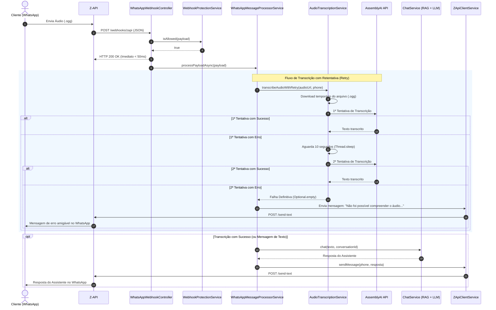

# Plano de Implementação: Suporte a Mensagens de Áudio com Transcrição no virtual-assistant

Este documento define a arquitetura, o fluxo de dados e os detalhes de implementação para habilitar o serviço `virtual-assistant` a receber mensagens de áudio do WhatsApp via Z-API, transcrevê-las utilizando a API da **AssemblyAI** (Speech-to-Text em português) e responder ao cliente em formato de texto através do atendente virtual.

---

## 🏗️ 1. Visão Geral da Arquitetura

O webhook da Z-API envia requisições HTTP para o endpoint `POST /webhooks/zapi`. O sistema preserva integralmente o fluxo de mensagens de texto já existente e adiciona um canal de processamento para mensagens de áudio gravadas no WhatsApp (`.ogg` com codec Opus), com algoritmo de resiliência e retentativa (retry de 10 segundos).

### Diagrama de Sequência



---

## ⚙️ 2. Diagnóstico e Decisões Técnicas

1. **Garantia de Não-Regressão do Fluxo de Texto:**
   - Mensagens contendo texto continuam sendo direcionadas diretamente ao `ChatService`, sem qualquer intervenção ou atraso decorrente do módulo de áudio.
2. **Desacoplamento Assíncrono da Thread HTTP:**
   - A Z-API possui timeout estrito e pode reenviar mensagens caso não receba status HTTP 200 em poucos segundos.
   - O método assíncrono `@Async` foi isolado em um serviço Spring próprio (`WhatsAppMessageProcessorService`), evitando o problema clássico de auto-chamada interna no Spring AOP que bloquearia a thread do controller.
   - O controller retorna HTTP 200 OK imediatamente (< 50ms).
3. **Resiliência e Retentativa de Transcrição (10 segundos):**
   - Caso a primeira chamada à API da AssemblyAI falhe (por oscilação de rede, timeout ou indisponibilidade transitória), o sistema aguarda **10 segundos** (`Thread.sleep(10_000)`) e tenta novamente.
   - Se a segunda tentativa também falhar, a transcrição é cancelada e o cliente recebe uma mensagem amigável no WhatsApp solicitando o reenvio de novo áudio ou de uma mensagem por texto.
4. **Gerenciamento de Arquivos em Disco:**
   - O arquivo de áudio temporário é baixado no formato nativo `.ogg`.
   - Um bloco `finally` garante a exclusão imediata do arquivo (`Files.deleteIfExists(tempFile)`) ao término do processamento, evitando consumo indevido de disco.

---

## 🧩 3. Detalhamento dos Componentes

### 3.1. Dependência Maven (`pom.xml`)
Adicionada a biblioteca oficial do AssemblyAI Java SDK:
```xml
<dependency>
    <groupId>com.assemblyai</groupId>
    <artifactId>assemblyai-java</artifactId>
    <version>2.1.2</version>
</dependency>
```

### 3.2. Configurações (`application.yml` e Classes de Configuração)
Configuração centralizada da chave de API e do idioma no `application.yml`:
```yaml
app:
  assemblyai:
    api-key: ${ASSEMBLYAI_API_KEY:}
    language-code: "pt"
    retry-delay-ms: 10000 # 10 segundos
```

- **`AssemblyAiProperties.java`**: Record mapeando as propriedades sob o prefixo `app.assemblyai`.
- **`AssemblyAiConfig.java`**: Expõe o bean `AssemblyAI` gerenciado pelo Spring.

### 3.3. DTO do Webhook (`ZApiWebhookPayload.java`)
Evoluído para suportar payloads contendo tanto mensagens de texto quanto de áudio:
```java
public record ZApiWebhookPayload(
        @JsonProperty("phone") String phone,
        @JsonProperty("fromMe") Boolean fromMe,
        @JsonProperty("messageId") String messageId,
        @JsonProperty("isGroup") Boolean isGroup,
        @JsonProperty("status") String status,
        @JsonProperty("text") MessageData messageData,
        @JsonProperty("audio") AudioData audioData) {

    public record MessageData(@JsonProperty("message") String message) {}
    public record AudioData(@JsonProperty("audioUrl") String audioUrl, @JsonProperty("mimeType") String mimeType) {}

    public boolean isText() {
        return messageData != null && messageData.message() != null && !messageData.message().isBlank();
    }

    public boolean isAudio() {
        return audioData != null && audioData.audioUrl() != null && !audioData.audioUrl().isBlank();
    }
}
```

### 3.4. Filtro de Segurança e Deduplicação (`WebhookProtectionService.java`)
- Validação atualizada para aceitar mensagens onde `payload.isText() || payload.isAudio()`.
- Cálculo de chave de deduplicação dinâmico: utiliza o hash do texto para mensagens de texto e o hash da URL do áudio para mensagens de voz quando o `messageId` for nulo.

### 3.5. Serviço de Transcrição (`AudioTranscriptionService.java`)
- Faz o download do binário via `HttpClient` (suporta URLs HTTP/HTTPS e caminhos locais `file:/` para testes).
- Executa a transcrição com `TranscriptOptionalParams` (idioma Português, pontuação automática e formatação de texto).
- Implementa a política de retry:
  - **Tentativa 1**: se retornar texto com status `COMPLETED`, retorna `Optional.of(text)`.
  - **Intervalo**: se houver erro ou exceção, aguarda 10 segundos.
  - **Tentativa 2**: executa nova tentativa. Se falhar, retorna `Optional.empty()`.
- Limpa o arquivo temporário baixado em bloco `finally`.

### 3.6. Processador Assíncrono (`WhatsAppMessageProcessorService.java`)
- Método `@Async public void processPayloadAsync(ZApiWebhookPayload payload)`:
  - Roteia texto diretamente para o `ChatService`.
  - Roteia áudio para o `AudioTranscriptionService`.
  - Se a transcrição falhar após as duas tentativas, dispara a mensagem de aviso via `ZApiClientService`:
    > *"Não foi possível compreender o áudio enviado. Por favor, tente enviar um novo áudio ou envie sua mensagem por texto."*
  - Se a transcrição tiver sucesso, submete o texto ao atendente virtual e devolve a resposta em texto ao cliente.

### 3.7. Controller do Webhook (`WhatsAppWebhookController.java`)
- Valida permissão via `WebhookProtectionService`.
- Despacha o processamento para o `WhatsAppMessageProcessorService`.
- Retorna `200 OK` instantaneamente à Z-API.

---

## 🧪 4. Testes e Validação

### 4.1. Testes Automatizados Implementados
- `AudioTranscriptionServiceTest.java`:
  - Validação de sucesso imediato na 1ª tentativa.
  - Validação de recuperação com sucesso na 2ª tentativa após falha na 1ª (testando a pausa do retry).
  - Validação de falha definitiva caso ambas as tentativas falhem.
  - Validação de chave de API ausente/nula.
- `WhatsAppMessageProcessorServiceTest.java`:
  - Processamento de mensagem de texto (garantia de regressão).
  - Processamento de áudio com transcrição bem-sucedida.
  - Envio da mensagem de erro/fallback ao cliente quando o áudio falha.
- `WebhookProtectionServiceTest.java`:
  - Permissão de texto e áudio válidos.
  - Bloqueio de auto-respostas (`fromMe=true`) e grupos (`isGroup=true`).
  - Deduplicação de requisições de texto e áudio.

### 4.2. Teste Manual com PowerShell

#### Teste 1: Mensagem de Texto (Regressão)
```powershell
$body = @{
    phone = "5511999999999"
    fromMe = $false
    text = @{
        message = "Olá, gostaria de informações sobre antecipação de recebíveis."
    }
} | ConvertTo-Json -Depth 3

Invoke-RestMethod -Uri "http://localhost:8080/webhooks/zapi" -Method Post -Body $body -ContentType "application/json"
```

#### Teste 2: Mensagem de Áudio Válida
```powershell
$body = @{
    phone = "5511999999999"
    fromMe = $false
    audio = @{
        audioUrl = "https://actions.google.com/sounds/v1/alarms/beep_short.ogg"
        mimeType = "audio/ogg; codecs=opus"
    }
} | ConvertTo-Json -Depth 3

Invoke-RestMethod -Uri "http://localhost:8080/webhooks/zapi" -Method Post -Body $body -ContentType "application/json"
```

#### Teste 3: Simulação de Retry e Mensagem de Erro (URL Inválida)
```powershell
$body = @{
    phone = "5511999999999"
    fromMe = $false
    audio = @{
        audioUrl = "https://url-invalida-teste.com/audio_corrompido.ogg"
        mimeType = "audio/ogg; codecs=opus"
    }
} | ConvertTo-Json -Depth 3

Invoke-RestMethod -Uri "http://localhost:8080/webhooks/zapi" -Method Post -Body $body -ContentType "application/json"
```
**Comportamento esperado nos logs:**
1. Log: *"1ª tentativa de transcrição falhou... Aguardando 10 segundos..."*
2. Intervalo de 10 segundos de espera.
3. Log: *"2ª tentativa de transcrição falhou... Transcrição abortada."*
4. Envio ao WhatsApp: *"Não foi possível compreender o áudio enviado. Por favor, tente enviar um novo áudio ou envie sua mensagem por texto."*

---

## 🔑 5. Configuração de Credenciais

Para execução com transcrição real:
1. Obtenha a API Key gratuita no site da [AssemblyAI](https://www.assemblyai.com/).
2. No ambiente local / PowerShell:
   ```powershell
   $env:ASSEMBLYAI_API_KEY="sua_chave_assemblyai_aqui"
   ```
3. No Docker (`.env` ou `docker-compose.yml`):
   ```env
   ASSEMBLYAI_API_KEY=sua_chave_assemblyai_aqui
   ```
4. No Google Cloud Platform (Cloud Run):
   - Adicione o segredo `ASSEMBLYAI_API_KEY` no Secret Manager e monte-o como variável de ambiente no serviço.
